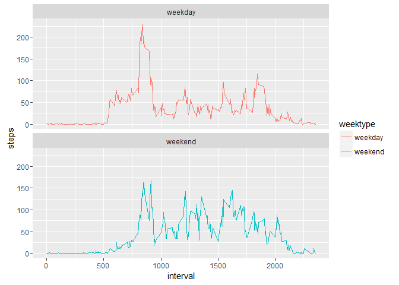

# Peer Assessment 1 for Reproducible Research - personal activity monitoring
----------------------------------------------------------------------------

## Introduction
This assignment makes use of data from a personal activity monitoring device. This device collects data at 5 minute intervals through out the day. The data consists of two months of data from an anonymous individual collected during the months of October and November, 2012 and include the number of steps taken in 5 minute intervals each day.

## Data
The data for this assignment can be downloaded from the course web site:https://d396qusza40orc.cloudfront.net/repdata%2Fdata%2Factivity.zip


The variables included in this dataset are:

steps: Number of steps taking in a 5-minute interval (missing values are coded as NA)

date: The date on which the measurement was taken in YYYY-MM-DD format

interval: Identifier for the 5-minute interval in which measurement was taken

The dataset is stored in a comma-separated-value (CSV) file and there are a total of 17,568 observations in this dataset.

## Global Default

In this assignment code will be represented to show how the results have been achieved. Default of echo will be set to be true throughout the document.


```rsetoptions
opts_chunk$set(echo=TRUE)

```

## Load Packages


```r
library (dplyr)
```

```
## 
## Attaching package: 'dplyr'
```

```
## The following objects are masked from 'package:stats':
## 
##     filter, lag
```

```
## The following objects are masked from 'package:base':
## 
##     intersect, setdiff, setequal, union
```

```r
library(lubridate)
```

```
## Warning: package 'lubridate' was built under R version 3.2.5
```

```
## 
## Attaching package: 'lubridate'
```

```
## The following object is masked from 'package:base':
## 
##     date
```

```r
library(ggplot2)
```

```
## Warning: package 'ggplot2' was built under R version 3.2.4
```


## Loading and preprocessing the data
1. Load the data (i.e. read.csv())


```r
activity <- read.csv("activity.csv", header = TRUE, sep = ',', colClasses = c("numeric", "character","integer"))
```
                                                                          
2. Change the date into dateformat using lubridate


```r
activity$date <- ymd(activity$date)
```

3. Check the data with str() and head()

```r
str (activity)
```

```
## 'data.frame':	17568 obs. of  3 variables:
##  $ steps   : num  NA NA NA NA NA NA NA NA NA NA ...
##  $ date    : Date, format: "2012-10-01" "2012-10-01" ...
##  $ interval: int  0 5 10 15 20 25 30 35 40 45 ...
```

```r
head (activity)
```

```
##   steps       date interval
## 1    NA 2012-10-01        0
## 2    NA 2012-10-01        5
## 3    NA 2012-10-01       10
## 4    NA 2012-10-01       15
## 5    NA 2012-10-01       20
## 6    NA 2012-10-01       25
```


## What is mean total number of steps taken per day?
For this part of the assignment, ignore the missing values in the dataset.

1.Calculate the total number of steps taken per day

2. If you do not understand the difference between a histogram and a barplot, research the difference between them. Make a histogram of the total number of steps taken each day

3.Calculate and report the mean and median of the total number of steps taken per day

Result

A.Calculate the total number of steps per day using dplyr package


```r
stepsPerDay <- activity %>%
  filter(!is.na(steps)) %>%
  group_by(date) %>%
  summarize(steps = sum(steps)) %>%
  print
```

```
## Source: local data frame [53 x 2]
## 
##          date steps
##        (date) (dbl)
## 1  2012-10-02   126
## 2  2012-10-03 11352
## 3  2012-10-04 12116
## 4  2012-10-05 13294
## 5  2012-10-06 15420
## 6  2012-10-07 11015
## 7  2012-10-09 12811
## 8  2012-10-10  9900
## 9  2012-10-11 10304
## 10 2012-10-12 17382
## ..        ...   ...
```

B. Make Histogram using ggplot package


```r
ggplot(stepsPerDay, aes(x = steps)) +
  geom_histogram(fill = "firebrick", binwidth = 1000) +
  labs(title = "Histogram of Steps per day", x = "Steps per day", y = "Frequency")
```

<!-- -->

C.Calculate the mean and median of the total number of steps taken per day

```r
mean_steps <- mean(stepsPerDay$steps, na.rm = TRUE)
median_steps <- median(stepsPerDay$steps, na.rm = TRUE)
```


```r
mean_steps
```

```
## [1] 10766.19
```


```r
median_steps
```

```
## [1] 10765
```

Mean steps= 10766 and median steps=10765

## What is the average daily activity pattern?

1. Make a time series plot of the 5-minute interval (x-axis) and the average number of steps taken, averaged across all days (y-axis)

2. Which 5-minute interval, on average across all the days in the dataset, contains the maximum number of steps?.

Result

1. Calculate the average number of steps taken in each 5-minute interval using dplyr package

```r
interval <- activity %>%
  filter(!is.na(steps)) %>%
  group_by(interval) %>%
  summarize(steps = mean(steps))
```

2. Make time series plot using ggplot


```r
ggplot(interval, aes(x=interval, y=steps)) +
  geom_line(color = "firebrick")
```

<!-- -->

3.Maximum steps, on average, across all the data steps


```r
interval[which.max(interval$steps),]
```

```
## Source: local data frame [1 x 2]
## 
##   interval    steps
##      (int)    (dbl)
## 1      835 206.1698
```

The interval 835 has the highest count of steps, with 206 steps


## Imputing missing values

1.Calculate and report the total number of missing values in the dataset (i.e. the total number of rows with NAs)


```r
sum(is.na(activity$steps))
```

```
## [1] 2304
```

Missing values are 2304

2. fill in a missing NA with the average number of steps in the same 5-min interval

3.Create a new dataset as the original and use tapply for filling in the missing values with the average number of steps per 5-minute interval


```r
activity_full <- activity
nas <- is.na(activity_full$steps)
avg_interval <- tapply(activity_full$steps, activity_full$interval, mean, na.rm=TRUE, simplify=TRUE)

activity_full$steps[nas] <- avg_interval[as.character(activity_full$interval[nas])]
```

 Check that there are no missing values in new data set 
 

```r
sum(is.na(activity_full$steps))
```

```
## [1] 0
```

Number of missing values in new data set activity_full = zero

4. Calculate number of steps aken in each 5-minute interval per day and Make a histogram of the total number of steps taken each day


```r
steps_full <- activity_full %>%
  filter(!is.na(steps)) %>%
  group_by(date) %>%
  summarize(steps = sum(steps)) %>%
  print
```

```
## Source: local data frame [61 x 2]
## 
##          date    steps
##        (date)    (dbl)
## 1  2012-10-01 10766.19
## 2  2012-10-02   126.00
## 3  2012-10-03 11352.00
## 4  2012-10-04 12116.00
## 5  2012-10-05 13294.00
## 6  2012-10-06 15420.00
## 7  2012-10-07 11015.00
## 8  2012-10-08 10766.19
## 9  2012-10-09 12811.00
## 10 2012-10-10  9900.00
## ..        ...      ...
```


```r
ggplot(steps_full, aes(x = steps)) +
  geom_histogram(fill = "firebrick", binwidth = 1000) +
  labs(title = "Histogram of Steps per day, including missing values", x = "Steps per day", y = "Frequency")
```

<!-- -->


Calculate and report the mean and median total number of steps taken per day


```r
mean_steps_full <- mean(steps_full$steps, na.rm = TRUE)
median_steps_full <- median(steps_full$steps, na.rm = TRUE)
```


mean

```r
mean_steps_full
```

```
## [1] 10766.19
```


median

```r
median_steps_full
```

```
## [1] 10766.19
```


Both the mean and the median are equal to the same value: 10766 when   missing data are imputed with the average number of steps in the same 5-min interval. 


## Are there differences in activity patterns between weekdays and weekends?


1. Create a new factor variable in the dataset with two levels - "weekday" and "weekend" indicating whether a given date is a weekday or weekend day.


```r
activity_full <- mutate(activity_full, weektype = ifelse(weekdays(activity_full$date) == "Saturday" | weekdays(activity_full$date) == "Sunday", "weekend", "weekday"))

activity_full$weektype <- as.factor(activity_full$weektype)


head(activity_full)
```

```
##       steps       date interval weektype
## 1 1.7169811 2012-10-01        0  weekday
## 2 0.3396226 2012-10-01        5  weekday
## 3 0.1320755 2012-10-01       10  weekday
## 4 0.1509434 2012-10-01       15  weekday
## 5 0.0754717 2012-10-01       20  weekday
## 6 2.0943396 2012-10-01       25  weekday
```

2. Make a panel plot containing a time series plot


```r
interval_full <- activity_full %>%
  group_by(interval, weektype) %>%
  summarise(steps = mean(steps))

t <- ggplot(interval_full, aes(x=interval, y=steps, color = weektype)) +
  geom_line() +
  facet_wrap(~weektype, ncol = 1, nrow=2)
print(t)
```

<!-- -->


